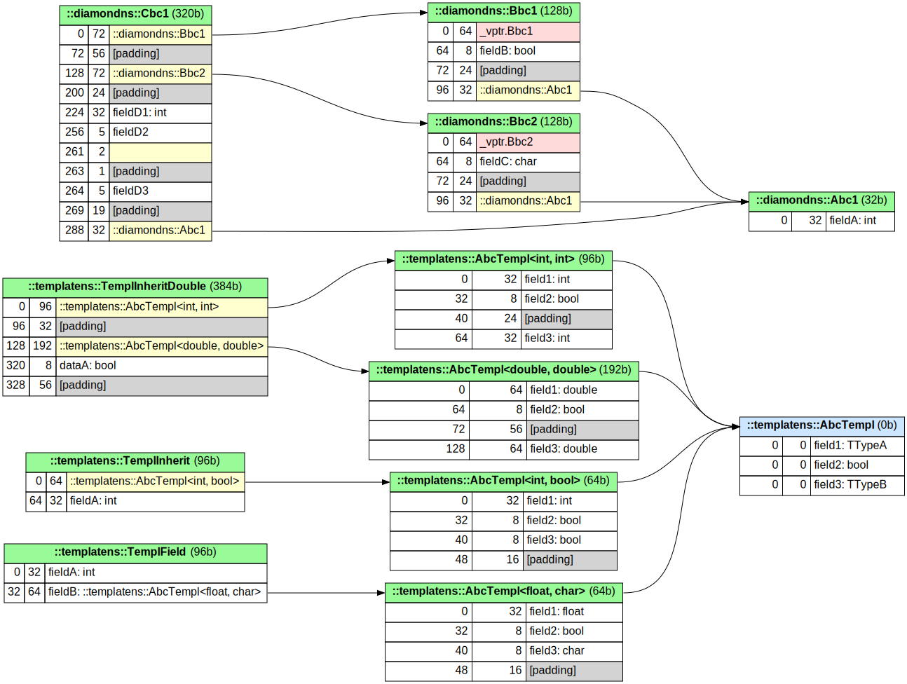
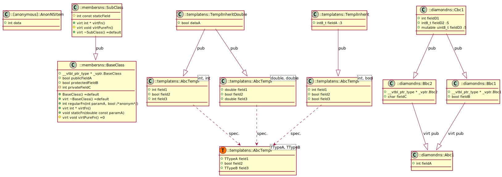

# gcc-uml

Generate varius outputs based on gcc internal tree data. Program, among others, produces following artifacts:
- [inheritance diagram](#inheritgraph),
- [memory layout diagram](#memlayout),
- [activity diagram](#ctrlflowgraph),
- [HTML version of compiler internal tree](#printhtml) (more human-friendly).

To generate include graph using gcc or clang use project 
[cpp-include-graph](https://github.com/anetczuk/cpp-include-graph).

Project is inspired by *clang-uml* tool.

*Note*: this is early stage of the project, so many things can change.


## Tools

Application consists of following tools:

### memlayout

*memlayout* generates memory layout of structures.

Following example presents diamond inheritance and template use:

[](doc/samples/mem_sample.cpp.svg)

### inheritgraph

With *inheritgraph* it is possible to generate inheritance diagram. It look like class diagram, but limited to 
inheritance relationship.

Example presents inheritance graph with diamond and template example:

[](doc/samples/inherit_sample.cpp.svg)

### ctrlflowgraph

*ctrlflowgraph* generates UML activity diagram.

*Note*: currently *ctrlflowgraph* tool handles very small subset of *gcc* tree tokens.

Example consists of switch and method call.

[](doc/samples/ctrl_sample.cpp.puml.svg)

### printhtml

*printhtml* tool prints *g++* internal tree in form of HTML pages. By default this form is slightly transformed:

- *chain* elements are convert to list of attributes,
- *tree_list* and *chan* elements are converted to list.

Transformations can be disabled through command line argument.

All expanded elements (by default) can be collapsed.

Example presents structure of *type_def* element:

[](doc/samples/printhtml-page.png)


## Running

Use of application requires two steps:

1. obtaining internal tree data from *g++*,
2. executing the tool.


#### Obtaining data from *g++*

*gcc-uml* as input needs intermediate data from *g++* compiler. Compilation have to be done using `-fdump-lang-raw` flag
informing compiler to print translation unit internal representation to file.
Passing the flag to `cmake` and obtaining internal representation can be done in following way:
```
    cmake -DCMAKE_C_COMPILER=gcc -DCMAKE_CXX_COMPILER=g++ \
          -DCMAKE_CXX_FLAGS="-fdump-lang-raw" \
          ...
    cmake --build .
```
Similarly, running `make` can be done like this:
```
    make CXX_FLAGS="-fdump-lang-raw"
```
Following command works for `Makefile`-s generated by `cmake` (it's impossible to change compiler without 
calling `cmake`). For custom made `Makefile`-s investigate the file (try *standarized* `CXX="g++"` and `CXXFLAGS="-fdump-lang-raw"`).


#### Running the application

To run application simply execute followoing command:
```
python3 -m gccuml.main --help
```

Application provides limited support for *clang-uml* configuration files. Before use the config file have to be changed 
in following ways:
- supported diagram types: `inheritgraph`,`memlayout`,`ctrlflowgraph`,
- input / glob file paths have to contain `.003l.raw` extension instead of `.h`, `.cpp` or similar,
- relative paths have to be changed from source to build directory (there are stored `.003l.raw` files).

Application accepts following arguments:

<!-- insertstart include="doc/cmdargs.txt" pre="\n" post="\n" -->
```
usage: python3 -m gccuml.main [-h] [--loglevel LOGLEVEL] [-la]
                              [--exitloglevel EXITLOGLEVEL] [--listtools]
                              {config,printhtml,inheritgraph,memlayout,ctrlflowgraph,tools}
                              ...

generate UML-like diagrams based on gcc/g++ internal tree

options:
  -h, --help            show this help message and exit
  --loglevel LOGLEVEL   Set log level (default: None)
  -la, --logall         Log all messages (default: False)
  --exitloglevel EXITLOGLEVEL
                        Set exit log level (default: None)
  --listtools           List tools (default: False)

subcommands:
  use one of tools

  {config,printhtml,inheritgraph,memlayout,ctrlflowgraph,tools}
                        one of tools
    config              read configuration file
    printhtml           generate static HTML for internal tree file
    inheritgraph        generate inheritance graph
    memlayout           generate memory layout diagram
    ctrlflowgraph       generate control flow diagram
    tools               various tools
```


```
usage: python3 -m gccuml.main config [-h] --path PATH

read configuration file

options:
  -h, --help   show this help message and exit
  --path PATH  Path to configuration YAML file (default: None)
```


```
usage: python3 -m gccuml.main printhtml [-h] --rawfile RAWFILE [-j JOBS]
                                        [--progressbar [PROGRESSBAR]]
                                        [--reducepaths REDUCEPATHS]
                                        [--notransform [NOTRANSFORM]]
                                        [--genentrygraphs [GENENTRYGRAPHS]]
                                        [--usevizjs [USEVIZJS]]
                                        [-ii [INCLUDEINTERNALS]] --outpath
                                        OUTPATH

generate static HTML for internal tree file

options:
  -h, --help            show this help message and exit
  --rawfile RAWFILE     Path to internal tree file (.003l.raw) to analyze
                        (default: None)
  -j JOBS, --jobs JOBS  Number to subprocesses to execute. Auto means to spawn
                        job per CPU core. (default: auto)
  --progressbar [PROGRESSBAR]
                        Show progress bar (default: True)
  --reducepaths REDUCEPATHS
                        Prefix to remove from paths inside tree (default:
                        None)
  --notransform [NOTRANSFORM]
                        Should prevent transforming internal tree before
                        printing? (default: False)
  --genentrygraphs [GENENTRYGRAPHS]
                        Should graph be generated for each entry? (default:
                        True)
  --usevizjs [USEVIZJS]
                        Use viz.js standalone for graph rendering. (default:
                        True)
  -ii [INCLUDEINTERNALS], --includeinternals [INCLUDEINTERNALS]
                        Should include compiler internals? (default: False)
  --outpath OUTPATH     Output directory of HTML representation (default:
                        None)
```


```
usage: python3 -m gccuml.main inheritgraph [-h] --rawfile RAWFILE
                                           [--reducepaths REDUCEPATHS]
                                           --outpath OUTPATH

generate inheritance graph

options:
  -h, --help            show this help message and exit
  --rawfile RAWFILE     Path to internal tree file (.003l.raw) to analyze
                        (default: None)
  --reducepaths REDUCEPATHS
                        Prefix to remove from paths inside tree (default:
                        None)
  --outpath OUTPATH     Output path of PlantUML representation (default: None)
```


```
usage: python3 -m gccuml.main memlayout [-h] --rawfile RAWFILE
                                        [-ii [INCLUDEINTERNALS]]
                                        [--reducepaths REDUCEPATHS]
                                        [--graphnote GRAPHNOTE] --outpath
                                        OUTPATH

generate memory layout diagram

options:
  -h, --help            show this help message and exit
  --rawfile RAWFILE     Path to raw file to analyze (default: None)
  -ii [INCLUDEINTERNALS], --includeinternals [INCLUDEINTERNALS]
                        Should include compiler internals? (default: False)
  --reducepaths REDUCEPATHS
                        Prefix to remove from paths inside tree (default:
                        None)
  --graphnote GRAPHNOTE
                        Note to put on graph (default: None)
  --outpath OUTPATH     Output path of DOT representation (default: None)
```


```
usage: python3 -m gccuml.main ctrlflowgraph [-h] --rawfile RAWFILE
                                            [-ii [INCLUDEINTERNALS]]
                                            [--reducepaths REDUCEPATHS]
                                            [--engine ENGINE] --outpath
                                            OUTPATH

generate control flow diagram

options:
  -h, --help            show this help message and exit
  --rawfile RAWFILE     Path to internal tree file (.003l.raw) to analyze
                        (default: None)
  -ii [INCLUDEINTERNALS], --includeinternals [INCLUDEINTERNALS]
                        Should include compiler internals? (default: False)
  --reducepaths REDUCEPATHS
                        Prefix to remove from paths inside tree (default:
                        None)
  --engine ENGINE       Diagram engine: dot, plantuml (default: dot)
  --outpath OUTPATH     Output path for DOT representation (default: None)
```


```
usage: python3 -m gccuml.main tools [-h] --rawfile RAWFILE
                                    [--reducepaths REDUCEPATHS]
                                    [-ii [INCLUDEINTERNALS]]
                                    [--outtypefields OUTTYPEFIELDS]
                                    [--outtreetxt OUTTREETXT]
                                    [--outbiggraph OUTBIGGRAPH]

various tools

options:
  -h, --help            show this help message and exit
  --rawfile RAWFILE     Path to internal tree file (.003l.raw)e to analyze
                        (default: None)
  --reducepaths REDUCEPATHS
                        Prefix to remove from paths inside tree (default:
                        None)
  -ii [INCLUDEINTERNALS], --includeinternals [INCLUDEINTERNALS]
                        Should include compiler internals? (default: False)
  --outtypefields OUTTYPEFIELDS
                        Output path to types and fields (default: None)
  --outtreetxt OUTTREETXT
                        Output path to tree print (default: None)
  --outbiggraph OUTBIGGRAPH
                        Output path to big graph (default: None)
```

<!-- insertend -->


## Installation

Installation of package can be done by:
 - to install package from downloaded ZIP file execute: `pip3 install --user -I file:gcc-uml-master.zip#subdirectory=src`
 - to install package directly from GitHub execute: `pip3 install --user -I git+https://github.com/anetczuk/gcc-uml.git#subdirectory=src`
 - uninstall: `pip3 uninstall gccuml`

Installation for development:
 - `install-deps.sh` to install package dependencies only (`requirements.txt`)
 - `install-package.sh` to install package in standard way through `pip` (with dependencies)
 - `install-devel.sh` to install package in developer mode using `pip` (with dependencies)


## Limitations

- pre `gcc-15` versions have bug that does not allow to detect call to virtual method
- in case of bitfields there is no information about bitfield type


## Callgraph info

Other interesting *gcc* option is `-fcallgraph-info`. `graph-easy` from `libgraph-easy-perl` can convert callgraph 
output to *dot* diagram.


## Development

All tests, linters and content generators can be executed by simple script `./process-all.sh`.

Unit tests are executed by `./src/testgccuml/runtests.py`.

Code linters can be run by `./tools/checkall.sh`.

In case of pull requests please run `process-all.sh` before the request.

#### Validation

In `validate` directory are two scripts `run-local-sources.sh` and `run-gcc-tests.sh`. They serve to run 
tools against various sources. In first case sources are taken from `examples` and in the other case 
sources are taken from `testsuite` in gcc source code (the source code is downloaded if needed).

The purpose of the scripts is to check tools agains runtime errors. It is very usefull in case of `ctrlflowgraph` 
to find unhandled lang tree elements.


## Similar projects

- [clang-uml](https://clang-uml.github.io/)


## References

- [GCC tree codes documentation (mirror)](https://github.com/gcc-mirror/gcc/blob/master/gcc/tree.def)
- [GCC C++ tree codes documentation (mirror)](https://github.com/gcc-mirror/gcc/blob/master/gcc/cp/cp-tree.def)
- [GCC source repository](https://gcc.gnu.org/git/?p=gcc.git)
- [Itanium C++ ABI](https://itanium-cxx-abi.github.io/cxx-abi/abi.html)
- [GCC Internals Manual](https://gcc.gnu.org/onlinedocs/gccint/)
- [G++ Developer Options](https://gcc.gnu.org/onlinedocs/gcc-13.1.0/gcc/Developer-Options.html#index-fdump-lang-all)
- [Viz.js](https://github.com/mdaines/viz-js)
- [clang-uml config options schema](https://github.com/bkryza/clang-uml/blob/master/src/config/schema.h)


## License

```
BSD 3-Clause License

Copyright (c) 2024, Arkadiusz Netczuk <dev.arnet@gmail.com>

Redistribution and use in source and binary forms, with or without
modification, are permitted provided that the following conditions are met:

1. Redistributions of source code must retain the above copyright notice, this
   list of conditions and the following disclaimer.

2. Redistributions in binary form must reproduce the above copyright notice,
   this list of conditions and the following disclaimer in the documentation
   and/or other materials provided with the distribution.

3. Neither the name of the copyright holder nor the names of its
   contributors may be used to endorse or promote products derived from
   this software without specific prior written permission.

THIS SOFTWARE IS PROVIDED BY THE COPYRIGHT HOLDERS AND CONTRIBUTORS "AS IS"
AND ANY EXPRESS OR IMPLIED WARRANTIES, INCLUDING, BUT NOT LIMITED TO, THE
IMPLIED WARRANTIES OF MERCHANTABILITY AND FITNESS FOR A PARTICULAR PURPOSE ARE
DISCLAIMED. IN NO EVENT SHALL THE COPYRIGHT HOLDER OR CONTRIBUTORS BE LIABLE
FOR ANY DIRECT, INDIRECT, INCIDENTAL, SPECIAL, EXEMPLARY, OR CONSEQUENTIAL
DAMAGES (INCLUDING, BUT NOT LIMITED TO, PROCUREMENT OF SUBSTITUTE GOODS OR
SERVICES; LOSS OF USE, DATA, OR PROFITS; OR BUSINESS INTERRUPTION) HOWEVER
CAUSED AND ON ANY THEORY OF LIABILITY, WHETHER IN CONTRACT, STRICT LIABILITY,
OR TORT (INCLUDING NEGLIGENCE OR OTHERWISE) ARISING IN ANY WAY OUT OF THE USE
OF THIS SOFTWARE, EVEN IF ADVISED OF THE POSSIBILITY OF SUCH DAMAGE.
```
